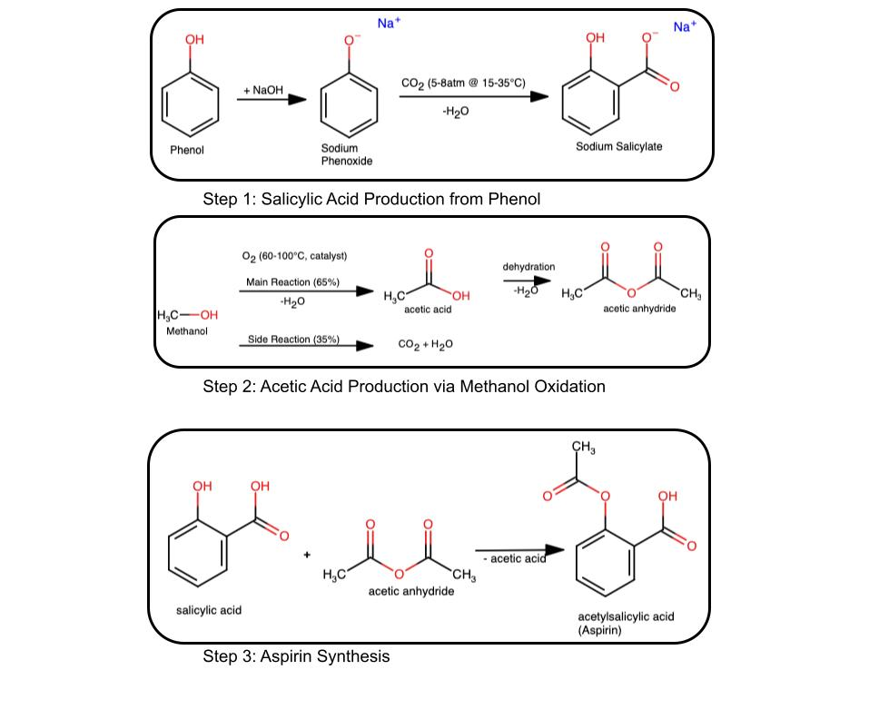

# Module 3: Multi-Step Pharmaceutical Synthesis Optimization
## README - Student Guide

---

## Overview

This module challenges you to optimize a three-step industrial process for producing aspirin (acetylsalicylic acid). You'll work with **real pilot-scale data** that includes inefficiencies, competing reactions, and gas handling challenges. Your goal is to identify bottlenecks, calculate theoretical and actual yields, apply gas laws, and recommend process improvements with economic justification.

**Key Challenge:** You must calculate yields yourself from measured masses—they are NOT given to you. You'll work backwards from actual product masses to determine process efficiency.

---

## Learning Objectives

By completing this module, you will:

1. **Balance complex chemical equations**, including challenging oxidation reactions with competing pathways
2. **Apply stoichiometric principles** to multi-step synthesis with cascade effects
3. **Identify limiting reagents** in realistic industrial scenarios where gas availability depends on pressure, temperature, and volume
4. **Master gas law applications**, including:
   - Ideal gas law (PV = nRT)
   - Van der Waals corrections for real gas behavior
   - Understanding when ideal gas assumptions break down
5. **Calculate process yields** through sequential reactions
6. **Analyze competing reactions** and selectivity in industrial processes
7. **Integrate chemical principles with economic and safety constraints**
8. **Communicate technical recommendations** professionally

---

## The Problem: Aspirin Production at DharmaChem Industries

### Current Situation
- **Overall yield: ~42%** (Your numbers will vary, Target: >75%)
- **$1.2M/year material waste** from poor efficiency
- **Safety incidents** from gas pressure fluctuations
- **Environmental penalties** from CO₂ emissions

### Your Mission
Identify why the process is underperforming and recommend specific, quantifiable improvements.

---

## The Three-Step Synthesis



### Step 1: Salicylic Acid from Phenol
```
C₆H₅ONa + CO₂ → C₆H₄(OH)COONa  (under pressure)
C₆H₄(OH)COONa + HCl → C₆H₄(OH)COOH + NaCl (acid workup)
```  
**Challenge:** CO₂ is a gas—you must use gas laws to determine how much is actually available!

### Step 2: Acetic Anhydride from Methanol
**UNBALANCED equations you must balance:**
```
CH₃OH + O₂ → CH₃COOH + H₂O  (desired partial oxidation)
CH₃OH + O₂ → CO₂ + H₂O      (undesired combustion - waste!)
2 CH₃COOH → (CH₃CO)₂O + H₂O (dehydration - assume 100%)
```
**Challenge:** Competing reactions! Some methanol burns to CO₂ instead of forming product.

### Step 3: Aspirin Synthesis
```
C₆H₄(OH)COOH + (CH₃CO)₂O → C₆H₄(OCOCH₃)COOH + CH₃COOH
(salicylic acid + acetic anhydride → aspirin + acetic acid)
```
**Challenge:** You're limited by whatever comes out of Steps 1 and 2!

---

## Key Concepts You'll Need

### 1. Stoichiometry Fundamentals

**Mole Concept:**  
- Convert mass to moles: n = mass / MW  
- Apply stoichiometric ratios from balanced equations  
- Convert moles back to mass: mass = n × MW  

**Limiting Reagent:**
The reactant that runs out first, limiting product formation.

**Percent Yield:**
```
% Yield = (Actual yield / Theoretical yield) × 100%
```  
Theoretical yield = maximum possible from stoichiometry  
Actual yield = what you actually recovered

**Cascade Effects:**
In multi-step synthesis, losses compound:  
```
Overall Yield = Y₁ × Y₂ × Y₃  
```  
If each step is 80%:  
```Overall = 0.80 × 0.80 × 0.80 = 51.2%  ```  
Poor yield in early steps impacts everything downstream!  

### 2. Gas Law Applications

**Why Gas Laws Matter Here:**  
- Step 1: CO₂ availability depends on pressure, temperature, and reactor volume  
- Step 2: O₂ availability affects conversion and selectivity  
- You can't just weigh gases like you weigh solids—must calculate moles from P, V, T  

**Ideal Gas Law:**  

```
PV = nRT

Where:
P = pressure (atm)
V = volume (L)
n = moles
R = 0.08206 L·atm/(mol·K)
T = temperature (Kelvin) = °C + 273.15
```

**Example:**

```
CO₂ at 7.0 atm, 25°C (298.15 K), in 150 L reactor:  
n = PV/RT = (7.0 × 150) / (0.08206 × 298.15) = 42.9 mol  
```

**When Ideal Gas Law Fails:**  
Real gases deviate from ideal behavior when:  
- **High pressure** (molecules closer together)  
- **Polar molecules** (stronger intermolecular forces)  

### 3. Van der Waals Corrections

**Van der Waals Equation:**
```
(P + a(n/V)²)(V - nb) = nRT
```

**What it accounts for:**  
- `a(n/V)²`: Intermolecular attractive forces (reduces effective pressure)  
- `nb`: Molecular volume (reduces available space)  

**Parameters for this problem:**  
- **CO₂:** a = 3.658 atm·L²/mol², b = 0.04267 L/mol  
- **O₂:** a = 1.378 atm·L²/mol², b = 0.03183 L/mol  

**How to Solve (Iterative Method):**
The equation is non-linear in n, so solve iteratively:  

```
1. Start with n from ideal gas law
2. Plug into right side of VDW equation
3. Solve for new n
4. Repeat 4-5 times until n converges
```

**When VDW Correction Matters:**  
Calculate deviation:

```
% Deviation = |n_VDW - n_ideal| / n_ideal × 100%

< 2%:  Ideal gas acceptable (but show both!)
2-5%:  Noticeable difference
> 5%:  Significant—MUST use VDW for accuracy
```

**Example Interpretation:**  
"At 7.0 atm, CO₂ shows 6.3% deviation from ideal gas law. This is significant, so Van der Waals corrections are necessary for accurate stoichiometric calculations."

### 4. Sequential Reactions & Material Flow

**The Cascade:**  

```
Phenoxide → Step 1 → Salicylic Acid → Step 2 (indirect) → Anhydride → Step 3 → Aspirin
```

Each step's output becomes the next step's input. You must track:  
1. What goes IN (charged to reactor)  
2. What comes OUT (recovered product)  
3. What was LOST (waste, incomplete reaction)  

**Material Balance:**  
Total mass in = Total mass out + accumulated  
Track each component through all three steps.  

### 5. Competing Reactions & Selectivity (Step 2)

**The Problem:**  
Methanol can undergo two reactions:  

```
Desired:   2 CH₃OH + O₂ → 2 CH₃COOH  (partial oxidation)
Undesired: 2 CH₃OH + 3 O₂ → 2 CO₂ + 4 H₂O  (combustion)
```

**Selectivity:**  

```
Selectivity = (moles to desired product) / (total moles reacted) × 100%
```

**How to Calculate:**  
You're given CO₂ waste mass. Work backwards:  

```
1. Convert CO₂ mass to moles
2. From balanced combustion equation, find moles of methanol that burned
3. Calculate moles of methanol that went to acetic acid
4. Determine selectivity
```

**Economic Impact:**
Methanol that burns to CO₂ is wasted money AND creates disposal costs!

---

## Your Analysis Workflow

### Phase 1: Balance Equations
1. **Verify Step 1 equations**   
2. **Balance Step 2 oxidation:** CH₃OH + O₂ → CH₃COOH
3. **Balance Step 2 combustion:** CH₃OH + O₂ → CO₂ + H₂O
4. **Verify Step 2 dehydration and Step 3**  

**Tip:** For oxidation reactions, balance C first, then H, then O last.

### Phase 2: Calculate Gas Moles (Steps 1 & 2)

**For EACH gas (CO₂ in Step 1, O₂ in Step 2):**
 
1. **Ideal Gas Law:**  

   ```
   n_ideal = PV/RT
   ```
 
2. **Van der Waals:**  

   ```
   Start with n = n_ideal
   Iterate: n = (P + a(n/V)²)(V - nb) / (RT)
   Repeat 4-5 times
   ```

3. **Calculate Deviation:**  

   ```
   % Deviation = |n_VDW - n_ideal| / n_ideal × 100%
   ```

4. **Interpret:**
   - State which method is more accurate
   - Explain why (pressure level, molecular properties)

### Phase 3: Stoichiometry & Limiting Reagents

**For EACH step:**  

1. **Convert all masses to moles**  
2. **Use stoichiometric ratios** from balanced equations  
3. **Identify limiting reagent:**  
   - Compare available mole ratios to required ratios  
   - Whichever reactant runs out first is limiting  
4. **Calculate theoretical yield** based on limiting reagent  
5. **Compare to actual recovered mass**  
6. **Calculate % yield:**  

   ```
   % Yield = (actual mass recovered / theoretical mass) × 100%
   ```

**CRITICAL for Step 2:**
- Account for selectivity when calculating acetic acid produced
- Use CO₂ waste to determine methanol lost to combustion

### Phase 4: Material Balance

Create a table tracking ALL components through all steps:  

NOTE: some cells may be blank if the corresponding compound is not involved in that particular step.

| Component | Step 1 Input (g) | Step 1 Output (g) | Step 2 Input (g) | Step 2 Output (g) | Step 3 Input (g) | Step 3 Output (g) |
|-----------|-----------------|------------------|-----------------|------------------|-----------------|------------------|
| Phenoxide | | | | | | |
| CO₂ (reactant) | | | | | | |
| Salicylic Acid | | | | | | |
| Methanol | | | | | | |
| O₂ (reactant) | | | | | | |
| Acetic Acid | | | | | | |
| CO₂ (waste product) | | | | | | |
| Acetic Anhydride | | | | | | |
| Aspirin | | | | | | |


### Phase 5: Overall Yield

```
Overall Yield = (Final aspirin mass) / (Maximum theoretical aspirin from phenoxide)

OR

Overall Yield = Y₁ × Y₂_eff × Y₃
```
where Y₂_eff accounts for both selectivity and conversion

### Phase 6: Compare Ideal vs. VDW Impact

**Critical requirement:**  
1. Calculate theoretical yields using ideal gas assumption  
2. Calculate theoretical yields using VDW-corrected gas moles  
3. Show the difference  
4. Discuss impact on overall yield  

**Example:**  
"Using ideal gas law overestimates CO₂ availability by 6.3%, which translates to a 4.2% overestimate in theoretical salicylic acid. This cascades to a 2.8% error in final aspirin yield calculation. Therefore, Van der Waals corrections are essential for accurate process analysis."

### Phase 7: Optimization

1. **Identify bottleneck:** Which step has lowest yield? Why?  
2. **Root cause:** Limiting reagent? Selectivity? Operating conditions?  
3. **Recommendations:**  
   - Specific changes (e.g., "Increase CO₂ pressure from 5.2 to 7.5 atm")  
   - Quantified improvements (e.g., "Expected to increase Step 1 yield from 62% to 82%")  
   - Safety verification (stays within limits)  
4. **Economic impact:**  
   - Additional reagent costs  
   - Value of increased production  

### Phase 8: Safety Analysis

1. **Temperature excursion:**  

   ```
   If T increases by 10°C, what happens to P?
   P₂ = P₁ × (T₂/T₁)  [at constant V, n]
   ```

2. **Compare to maximum operating pressure** from your data packet  

3. **Recommend relief valve setting** (typically 90% of max pressure)

4. **Step 2 O₂ hazards:**  
   - Explosion limits: 6-10 vol% O₂ in organic vapors  
   - Discuss safe operating range  

---

## Report Structure (2 pages + appendix)

### Problem Analysis (0.5 pages)
- Quantify current performance
- Identify key technical issues
- Summarize your recommendations and their benefits  

### Technical Analysis (1 page)

**Stoichiometric Analysis:**  
- Balanced equations  
- Material balance table  
- Limiting reagents with calculations  
- Yield analysis for each step  
- Selectivity calculation for Step 2  

**Gas Behavior Analysis:**  
- Ideal gas calculations for CO₂ AND O₂  
- Van der Waals corrections for both  
- Deviation percentages and interpretation  
- Comparison of theoretical yields (ideal vs. VDW)  
- Safety implications  

**Required Figure (choose ONE):**  
- **Option A:** Sankey diagram showing material flows and losses    
- **Option B:** Yield comparison chart (current vs. theoretical\_ideal vs. theoretical\_VDW vs. optimized)    
- **Option C:** Dual plot: (1) CO₂ P-T with ideal/VDW/safety limit, (2) Step 2 selectivity vs. O₂ ratio   

### Recommendations (0.5 pages)

**Process Optimization:**  
- Note and explain what amounts you might change  
- Note any justify any operating condition recommendations, such as volume or pressure changes  
- Suggest a strategy for improving Step 2 selectivity    
- Expected yield improvements  

**Economic Considerations:**  
- Current costs  
- Projected costs with improvements  
- Savings estimate   
- Qualitative discussion of waste disposal impacts  

**Safety Considerations:**  
- Pressure/temperature management  
- O₂ explosion hazards  
- Emergency relief valve recommendations  

### Computational Appendix & References
- Note any software used (Excel, Python, MATLAB, etc.)
- For this problem, you may need to consult a few outside references to better understand some of the calculations, concepts, or implementations discussed.  If you do so, include citations (any format is fine).  Scientific websites and reference books are acceptable.  You do not need to cite sources for trivial lookups (numbers, conversions, etc.) only for information that you bring in outside of your analysis.


---

## Common Pitfalls to Avoid

### 1. Forgetting to Balance Equations
❌ Using unbalanced equations in calculations  
✅ Always balance first, then calculate  

### 2. Temperature Units
❌ Using °C in PV = nRT  
✅ Always convert to Kelvin: T(K) = T(°C) + 273.15  

### 3. Only Using Ideal Gas Law
❌ Calculating with ideal gas only  
✅ Show BOTH ideal and Van der Waals, then compare  

### 4. Wrong Van der Waals Implementation
❌ Not iterating (just one calculation)  
✅ Iterate 4-5 times until convergence  

### 5. Missing Selectivity Calculation
❌ Ignoring CO₂ waste data  
✅ Use CO₂ waste to calculate Step 2 selectivity  

### 6. Forgetting 2:1 Ratio for Anhydride
❌ Assuming 1 mol acetic acid → 1 mol anhydride  
✅ Correct: 2 mol acetic acid → 1 mol anhydride  

### 7. Not Accounting for Cascade Effects
❌ Treating each step independently  
✅ Remember: Step 1 output feeds Step 2 (indirectly), Step 2 output feeds Step 3

### 8. Vague Recommendations
❌ "Use more CO₂"  
✅ "Increase CO₂ pressure from 5.2 atm to 7.5 atm to provide stoichiometric amount plus 10% excess"

### 9. Ignoring Safety Limits
❌ Recommending 12 atm when max is 10 atm  
✅ Always verify recommendations against safety data in your packet

### 10. Poor Units  
❌ Writing "n = 42.9" without units  
✅ Writing "n = 42.9 mol"  

---

## Example Van der Waals Calculation

**Problem:** Calculate moles of CO₂ at 7.0 atm, 25°C (298.15 K), in 150 L reactor

### Step 1: Ideal Gas Law

```
n_ideal = PV/RT
n_ideal = (7.0 atm × 150 L) / (0.08206 L·atm/(mol·K) × 298.15 K)
n_ideal = 1050 / 24.47
n_ideal = 42.92 mol
```

### Step 2: Van der Waals (Iterative)

**Given:** a = 3.658 atm·L²/mol², b = 0.04267 L/mol

**Equation:** (P + a(n/V)²)(V - nb) = nRT

**Rearranged for iteration:**

```
n = [(P + a(n/V)²) × (V - nb)] / (RT)  
```

**Iteration 1:** Start with n = 42.92 mol

```
n = [(7.0 + 3.658×(42.92/150)²) × (150 - 42.92×0.04267)] / (0.08206 × 298.15)  
n = [(7.0 + 3.658×0.0820) × (150 - 1.832)] / 24.47  
n = [(7.0 + 0.300) × 148.168] / 24.47  
n = [7.300 × 148.168] / 24.47  
n = 1081.6 / 24.47  
n = 44.21 mol  
```

**Iteration 2:** Use n = 44.21 mol

```
n = [(7.0 + 3.658×(44.21/150)²) × (150 - 44.21×0.04267)] / 24.47
n = [(7.0 + 0.316) × 148.114] / 24.47
n = 44.28 mol
```

**Iteration 3:** Use n = 44.28 mol

```
n = 44.29 mol (converged within 0.02%)
```

**Result:** n_VDW = 44.29 mol

### Step 3: Calculate Deviation
```
Deviation = |44.29 - 42.92| / 42.92 × 100%
Deviation = 1.37 / 42.92 × 100%
Deviation = 3.2%
```

### Interpretation:
"The Van der Waals correction gives 3.2% more CO₂ than the ideal gas law predicts. This is a noticeable difference that should be accounted for in stoichiometric calculations. The ideal gas law underestimates the amount of gas available because it doesn't account for the attractive forces between CO₂ molecules, which effectively reduce the pressure they exert on the container walls."

---


## Tips for Success

### Before You Start
1. Read your entire data packet carefully
2. Note all given values and units
3. Identify what you need to calculate
4. Plan your approach

### During Calculations
1. **Always include units** in every calculation
2. **Show your work** step-by-step in the appendix
3. **Check your answers** for reasonableness
   - Yields should be 0-100%
   - Masses should be positive
   - Moles should make sense for the scale
4. **Use consistent significant figures** 

### For Gas Laws
1. Calculate both ideal and VDW—don't skip either
2. Iterate VDW 4-5 times until convergence
3. Calculate and interpret deviation
4. Discuss impact on theoretical yields

### For Optimization
1. Be specific and quantitative
2. Support recommendations with calculations
3. Verify against safety limits
4. Consider economic trade-offs

### For Writing
1. Use professional technical language
2. Be concise but complete
3. Bold or highlight key findings
4. Make figure stand-alone (fully labeled)

---

## Getting Help

**If concepts are unclear:**  
- Review this README section  
- Ask questions in class—that's what we're here for!  
- Work through practice problems in your textbook  
- Form study groups to discuss approaches  

**What NOT to do:**
- Don't wait until the last minute  
- Don't guess at equations—verify they're balanced  
- Don't skip Van der Waals thinking it's "close enough"  
- Don't make recommendations without calculations  

---

## Software & Tools

You may use any software for calculations:
- **Excel/Google Sheets:** Good for organizing data, material balances, economic analysis  
- **Python/MATLAB:** Excellent for iterative VDW calculations  
- **Graphing tools:** For creating figures (Excel, Python matplotlib, Origin, etc.)
- **Calculator:** Sufficient for all calculations if you're careful

**If you use software:**
- Note it in your appendix
- Include key formulas or code snippets
- Don't just paste raw output—present results clearly


**Feel Free to use this Python code for solving the VdW equation:**

```
"""
Van der Waals Equation Iterative Solver
Solves: (P + a(n/V)²)(V - nb) = nRT
"""

# Define knowns
R = 0.08206              # L·atm/(mol·K)
P = 7.0                  # atm
V = 150.0                # L
T = 25.0 + 273.15        # K
a = 3.658                # atm·L²/mol² (CO2)
b = 0.04267              # L/mol (CO2)

# Initial guess from ideal gas law
n = (P * V) / (R * T)
print(f"Ideal gas: n = {n:.6f} mol\n")

# Iterative solution
iteration = 0
percent_change = 100.0

while percent_change > 1.0:
    iteration += 1
    n_new = ((P + a * (n / V)**2) * (V - n * b)) / (R * T)
    percent_change = abs((n_new - n) / n) * 100.0
    print(f"Iteration {iteration}: n = {n_new:.6f} mol, change = {percent_change:.4f}%")
    n = n_new
    if iteration > 100:
        break

# Final result
n_ideal = (P * V) / (R * T)
deviation = abs(n - n_ideal) / n_ideal * 100.0
print(f"\nFinal: n = {n:.6f} mol (VDW), deviation from ideal = {deviation:.2f}%")
```

---

## Academic Integrity

- Your data packet is unique to you
- I encourage you to discuss concepts and approaches with classmates
- You may NOT share numerical templates or calculations
- All work submitted must be your own
- Cite any external references you consult (not needed for basic data lookup)

---

## Summary Checklist

Before submitting, verify you have:

**Equations:**  
- ☐ All equations balanced (especially Step 2 oxidation reactions)  

**Gas Laws:**  
- ☐ Ideal gas law for CO₂ (Step 1)  
- ☐ Van der Waals for CO₂ (Step 1)  
- ☐ Ideal gas law for O₂ (Step 2)  
- ☐ Van der Waals for O₂ (Step 2)  
- ☐ Deviation percentages calculated for both  
- ☐ Discussion of when corrections matter  

**Stoichiometry:**  
- ☐ All masses converted to moles  
- ☐ Limiting reagent identified for each step  
- ☐ Theoretical yields calculated (with ideal AND VDW)  
- ☐ Actual yields calculated from measured masses  
- ☐ Percent yields determined  
- ☐ Step 2 selectivity calculated from CO₂ waste  
- ☐ Overall process yield calculated  

**Material Balance:**  
- ☐ Complete table tracking all components through three steps  
- ☐ Mass conservation verified  

**Optimization:**  
- ☐ Bottleneck identified with evidence  
- ☐ Specific, quantitative recommendations  
- ☐ Expected improvements calculated  
- ☐ Economic impact analyzed  
- ☐ Safety verified  

**Safety:**  
- ☐ Temperature excursion calculated (+10°C)  
- ☐ Compared to safety limits  
- ☐ Relief valve recommendation  
- ☐ O₂ hazards discussed  

**Report:**  
- ☐ One high-quality figure  
- ☐ Professional writing  
- ☐ All units included  
- ☐ Appendix with software and references 

---

## Final Thoughts

This is a challenging, realistic problem that mirrors what you'll face in industry. There's no single "right" answer for recommendations—different approaches can be valid if well-justified. Focus on:

1. **Rigorous calculations** (especially showing both ideal and VDW)  
2. **Clear reasoning** about bottlenecks and solutions  
3. **Quantitative support** for all recommendations  
4. **Professional communication** of your findings  

The goal isn't just to get numbers—it's to think like an engineer, integrating chemistry, data analytics, and economic/safety concerns to solve real problems.


---

*If anything in this README is unclear, please ask in class or come to office hours. These concepts are fundamental to chemical engineering, and we want you to master them.*

